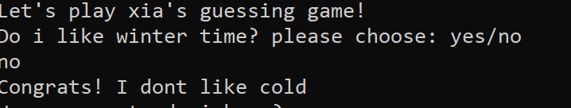
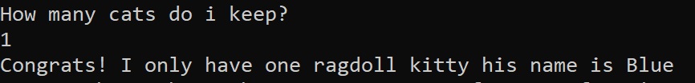
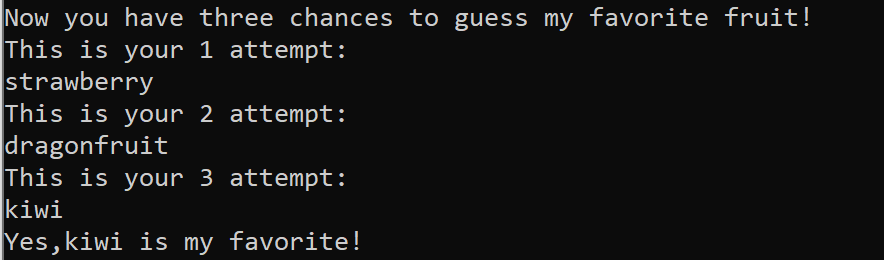
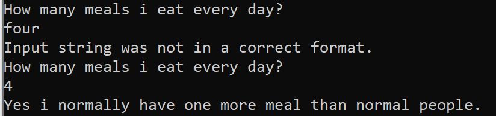
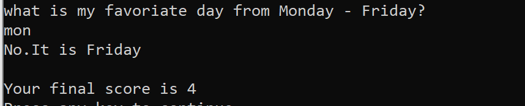

# lab01-AboutMeQuiz
 This is a guessing game, there are 5 quesions totally, one point for each question.
 Question one : correct answer is No.

 Question two:

Question three:you will have three times to type

Question four: you need to type the correct format, aftre three times if still not the correct format it will be counted as wrong answer and continues to next quesion

Question 5 and your final score
